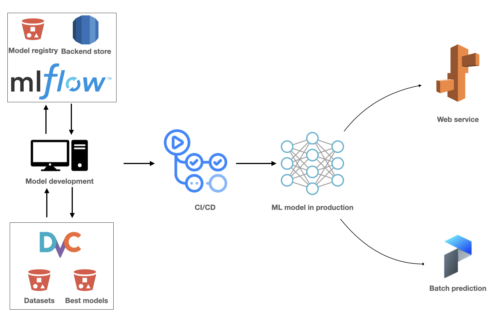
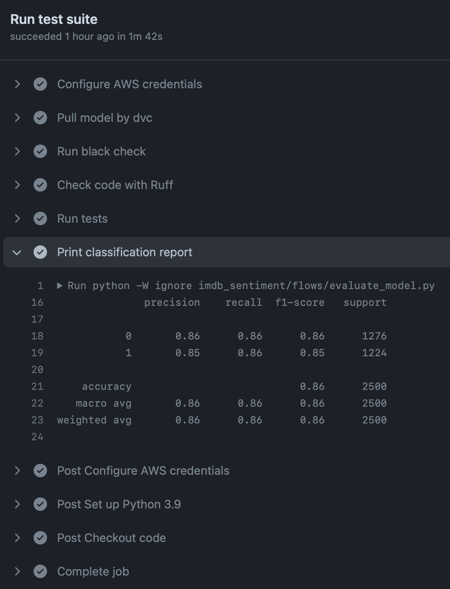
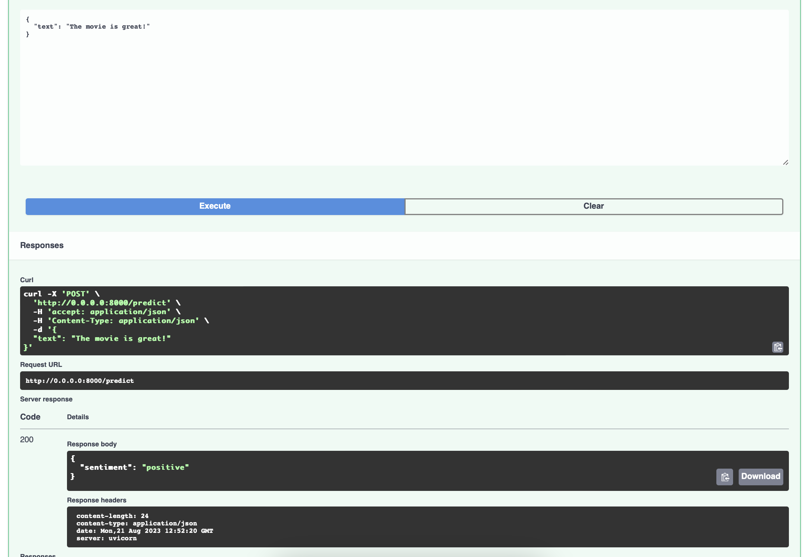

# IMDB Sentiment Analysis

# Problem statement

This project aims to build an MLOps pipeline for sentiment (positive or negative) analysis of IMDB movie reviews. The following diagram shows the architecture of the pipeline. The AWS infrastructure is managed by Terraform.

<p align="center"></p>

The development flow is that the developers create a new git branch and train ML models locally with a remote mlflow server. The datasets and best models are stored in S3 buckets and versioned by dvc. When a pull request is made, a CI flow is triggered to run the integration tests and present the performance in a report. After the pull request is merged, the model is deployed to AWS Elastic Beanstalk as a web service.

# For peer review

- [x] Cloud: The project uses AWS as the cloud provider and uses Terraform to manage the infrastructure.
- [x] Experiment tracking and model registry: The project uses mlflow to track the experiments and store the models in S3.
- [x] Workflow orchestration: The project uses prefect to make batch predictions.
- [x] CI/CD: The project uses Github Actions to run the integration tests. For deployment, the project uses AWS Elastic Beanstalk for the web service, however, the deployment is yet not fully automated and further details can be seen in the section `Trigger CI/CD` below.
- [x] Model monitoring: During the integration test, the model will be evaluated on a validation dataset and a report will be generated to show the model performance.
- [x] Reproducibility: The projects use poetry to manage the dependencies. The instructions below can be used to reproduce the results.
- [x] Best practices:
  - [x] Unit tests
  - [x] An integration test
  - [x] Code linting by ruff and formatting by black
  - [x] A pre-commit hook to run the linting and formatting
  - [x] A CI/CD pipeline


# Set up the environment

## Set up AWS credentials

1. In AWS IAM, create a user group with the following permissions policies, and ddd an new user to the group and download the credentials.
   - AdministratorAccess-AWSElasticBeanstalk	
   - AmazonEC2ContainerRegistryFullAccess	
   - AmazonEC2FullAccess	
   - AmazonRDSFullAccess	
   - AmazonS3FullAccess	
   - AWSElasticBeanstalkCustomPlatformforEC2Role

2. In EC2, go to `Network & Security` and create a new key pair with the name `mlflow` and download the private key.

3. On the local machine, install aws cli and use `aws configure` to set up the AWS credentials. Further details can be found [here](https://docs.aws.amazon.com/cli/latest/userguide/cli-configure-files.html).

4. Add AWS credentials `AWS_ACCESS_KEY_ID`  and `AWS_SECRET_ACCESS_KEY` in Github secrets. Further details can be found [here](https://docs.github.com/en/actions/security-guides/encrypted-secrets).

## Install project dependencies

Run the following command to install poetry and the dependencies. The version of Python is 3.9.
```bash
pip install -U pip
pip install poetry==1.5.1
poetry install
```

## Initiate the infrastructure

1. Install Terraform.

2. Go to the folder `infra/terraform` and run the following command to initiate the infrastructure.

```bash
terraform init
terraform apply -var-file="secrets.tfvars" --auto-approve
```

3. Set the mlflow tracking uri as an environment variable, otherwise a local mlflow server will be used during training.

```bash
# Set mlflow tracking uri as environment variable
export MLFLOW_TRACKING_URI=$(terraform output -raw mlflow_tracking_uri)

# Run the command and copy the result to a text file for later use.
terraform output mlflow_command
```

## Start mlflow server

1. Log in to the EC2 instance by the private key downloaded in the previous step.
2. In the EC2 instance, install required packages and run the command copied from the previous step to start the mlflow server.

```bash
pip install mlflow boto3 psycopg2-binary

# Start the mlflow server by the command copied from the previous step
mlflow server <...>
```

## Prepare the datasets

1. Copy the files in folder `imdb_data` and paste them to folder `data`. The latter folder is used in the MLops pipeline. 

2. Use dvc to track the datasets and push them to S3.

```bash
dvc add data/train.csv data/valid.csv data/test.csv
dvc push 
```

## Train the model

1. Before training the model, you need to create a new branch, which allows the CI/CD flow to work properly.  

2. Run the script `imdb_sentiment/flows/train_flow.py` to train the model. The results are stored in the folder `models`.

3. Use dvc to track the models and push it to S3.

```bash
dvc add models/model.pkl
dvc push model/model.pkl -r model
```

## Trigger CI/CD

1. Push the changes to Github and create a pull request, which will trigger the integration test automatically. The tests includes:
   - Check code funcitonality.
   - Check code format and linting.
   - Check if the model can pass sample cases.
   - Create a report to show the model performance.

<p align="center"></p>

1. Merge the pull request to the main branch, and the model will be deployed to AWS Elastic Beanstalk as a web service. However, the settings are not properly configured by terraform and hence the model cannot be automatically deployed.

2. To containerize the model as a service and run the app locally, run the following command. Open the browser and go to `http://localhost:8000/docs` to see the swagger documentation. Try the endpoint `POST /predict` to make a prediction.

```bash
docker build -t imdb-sentiment-predictor .
docker run -p 8000:8000 --rm imdb-sentiment-predictor
```
<p align="left"></p>

## Make batch predictions

The idea is to predict the sentiment of new reviews (which should be constantly updated, but is fixed in the current scenario). The dataset and model are stored in S3 bucket `imdb-reviews-monitoring-bucket`. The following steps show how to make batch predictions regularly by prefect.

1. Upload files to S3 bucket `imdb-reviews-monitoring-bucket`.

```bash
aws s3 cp data/test.csv s3://imdb-reviews-monitoring-bucket
aws s3 cp model/model.pkl s3://imdb-reviews-monitoring-bucket
```

2. Create a work pool for the prefect deployment.

```bash
prefect work-pool create --type process monitor-model-work-pool
```

3. Deploy the flow by the settins in `prefect.yaml`. 

```bash
prefect deploy --all
```

4. Create an agent from the work pool and the flow will be executed by the schedule. 

```bash
prefect worker start -p monitor-model-work-pool
```

5. We can manually trigger the flow run by clicking `Quick run` from the server UI. After the flow run is completed, we can see a file `test_prediction.csv` in the S3 bucket `imdb-reviews-monitoring-bucket`.

## Clean up

Go to the folder `infra/terraform` and run the following command to destroy the infrastructure.

```bash
terraform destroy -var-file="secrets.tfvars" --auto-approve
```
